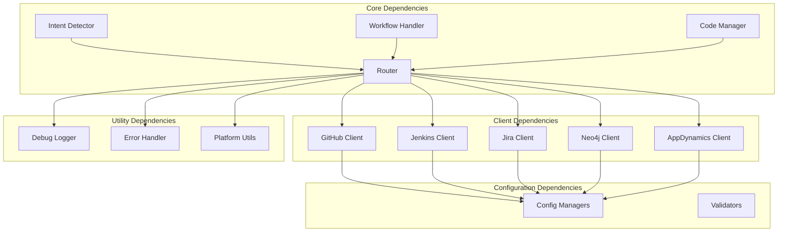

# 📚 Lumos CLI Module Functionality Reference

## 📋 Table of Contents
- [Root-Level Files](#root-level-files)
- [Core Modules](#core-modules)
- [Client Modules](#client-modules)
- [Interactive Modules](#interactive-modules)
- [Configuration Modules](#configuration-modules)
- [Utility Modules](#utility-modules)
- [UI Modules](#ui-modules)
- [Command Modules](#command-modules)

## 🔧 Core Modules

### Root-Level Files

#### `cli_refactored_v2.py` - Main CLI Entry Point
**Purpose**: Main CLI application entry point with command routing

**Key Functions**:
```python
def app() -> typer.Typer:
    """Main CLI application"""

def interactive() -> None:
    """Interactive mode entry point"""

def plan(task: str) -> None:
    """Code planning command"""

def edit(file_path: str, instruction: str) -> None:
    """Code editing command"""
```

**Dependencies**: `typer`, `rich`, all core modules

---

#### `config.py` - Main Configuration
**Purpose**: Central configuration management and environment loading

**Key Functions**:
```python
def load_env_file() -> None:
    """Loads environment variables from .env file"""

def get_config() -> dict:
    """Gets current configuration"""

def is_enterprise_configured() -> bool:
    """Checks if enterprise LLM is configured"""
```

**Dependencies**: `python-dotenv`, `os`

---

#### `agentic_router.py` - Agentic Routing System
**Purpose**: Advanced routing system for agentic workflows

**Key Classes**:
- `AgenticRouter`: Routes tasks to appropriate agents
- `Agent`: Base agent class for different capabilities

**Key Functions**:
```python
def route_agentic_task(task: str, context: dict) -> str:
    """Routes task to appropriate agent"""

def get_available_agents() -> List[str]:
    """Returns list of available agents"""
```

**Dependencies**: Core router, all client modules

---

#### `enterprise_llm.py` - Enterprise LLM Integration
**Purpose**: Enterprise LLM provider integration

**Key Classes**:
- `EnterpriseLLMProvider`: Enterprise LLM provider
- `EnterpriseLLMConfig`: Configuration management

**Key Functions**:
```python
def get_enterprise_llm() -> EnterpriseLLMProvider:
    """Gets enterprise LLM provider"""

def is_enterprise_configured() -> bool:
    """Checks if enterprise LLM is configured"""
```

**Dependencies**: `requests`, `typing`

---

#### `enterprise_llm_replica.py` - Enterprise LLM Replica
**Purpose**: Local replica of enterprise LLM for testing

**Key Classes**:
- `EnterpriseLLMReplica`: Local enterprise LLM simulation

**Key Functions**:
```python
def get_enterprise_llm_replica() -> EnterpriseLLMReplica:
    """Gets enterprise LLM replica"""

def configure_replica(config: dict) -> bool:
    """Configures the replica"""
```

**Dependencies**: `openai`, `requests`

---

#### `environment_manager.py` - Environment Management
**Purpose**: Manages development and production environments

**Key Functions**:
```python
def get_environment() -> str:
    """Gets current environment"""

def is_development() -> bool:
    """Checks if in development mode"""

def is_production() -> bool:
    """Checks if in production mode"""
```

**Dependencies**: `os`, `typing`

---

#### `gpt4_simulator.py` - GPT-4 Simulation
**Purpose**: Simulates GPT-4 behavior for testing

**Key Classes**:
- `GPT4Simulator`: GPT-4 simulation class

**Key Functions**:
```python
def simulate_gpt4(prompt: str) -> str:
    """Simulates GPT-4 response"""

def configure_simulator(config: dict) -> bool:
    """Configures the simulator"""
```

**Dependencies**: `openai`, `typing`

---

#### `huggingface_manager.py` - Hugging Face Integration
**Purpose**: Manages Hugging Face model integration

**Key Classes**:
- `HuggingFaceManager`: Hugging Face model manager

**Key Functions**:
```python
def load_model(model_name: str) -> Any:
    """Loads Hugging Face model"""

def generate_text(prompt: str, model: Any) -> str:
    """Generates text using Hugging Face model"""
```

**Dependencies**: `transformers`, `torch`

---

#### `logger.py` - Logging System
**Purpose**: Centralized logging system

**Key Functions**:
```python
def setup_logging() -> None:
    """Sets up logging configuration"""

def get_logger(name: str) -> logging.Logger:
    """Gets logger instance"""
```

**Dependencies**: `logging`, `os`

---

#### `prompts.py` - Prompt Templates
**Purpose**: Centralized prompt templates

**Key Functions**:
```python
def get_prompt(template_name: str) -> str:
    """Gets prompt template"""

def format_prompt(template: str, **kwargs) -> str:
    """Formats prompt with variables"""
```

**Dependencies**: `typing`

---

#### `safe_code_executor.py` - Safe Code Execution
**Purpose**: Safely executes code with validation

**Key Classes**:
- `SafeCodeExecutor`: Safe code execution class

**Key Functions**:
```python
def execute_code(code: str, language: str) -> dict:
    """Safely executes code"""

def validate_code(code: str, language: str) -> bool:
    """Validates code before execution"""
```

**Dependencies**: `subprocess`, `typing`

---

## 🔧 Core Modules

### `core/router.py` - LLM Routing System
**Purpose**: Central routing system for LLM backends and task classification

**Key Classes**:
- `LLMRouter`: Main routing class
- `TaskType`: Enum for task types (CODE_GENERATION, ANALYSIS, REVIEW, etc.)

**Key Functions**:
```python
def route_task(task: str, context: dict) -> str:
    """Routes task to appropriate LLM backend"""

def get_available_backends() -> List[str]:
    """Returns list of available LLM backends"""

def classify_task(task: str) -> TaskType:
    """Classifies task type for routing"""
```

**Dependencies**: OpenAI, Ollama, Hugging Face, Enterprise LLM

**Configuration**: Backend selection, model parameters, fallback chains

---

### `core/embeddings.py` - Vector Embeddings
**Purpose**: Vector embeddings for similarity search and context retrieval

**Key Classes**:
- `EmbeddingDB`: Database for storing and querying embeddings

**Key Functions**:
```python
def add_document(text: str, metadata: dict) -> str:
    """Adds document to embedding database"""

def search_similar(query: str, top_k: int = 5) -> List[dict]:
    """Searches for similar documents"""

def get_embedding(text: str) -> List[float]:
    """Generates embedding for text"""
```

**Dependencies**: OpenAI embeddings, FAISS (optional)

**Storage**: Local SQLite database with vector indices

---

### `core/safety.py` - File Safety System
**Purpose**: Safe file editing with validation and backup

**Key Classes**:
- `SafeFileEditor`: Main file editing class

**Key Functions**:
```python
def edit_file(file_path: str, changes: str) -> bool:
    """Safely edits file with validation"""

def create_backup(file_path: str) -> str:
    """Creates backup of file"""

def rollback_changes(file_path: str) -> bool:
    """Rolls back changes to file"""

def validate_file(file_path: str) -> bool:
    """Validates file before editing"""
```

**Features**: File validation, automatic backups, rollback capability

---

### `core/history.py` - Command History
**Purpose**: Command and session history management

**Key Classes**:
- `HistoryManager`: Manages command history

**Key Functions**:
```python
def add_command(command: str, result: str) -> None:
    """Adds command to history"""

def get_recent_commands(limit: int = 10) -> List[dict]:
    """Gets recent commands"""

def search_history(query: str) -> List[dict]:
    """Searches command history"""

def clear_history() -> None:
    """Clears command history"""
```

**Storage**: JSON files with optional encryption

---

### `core/intent_detector.py` - Intent Detection
**Purpose**: Intelligent intent detection and classification

**Key Classes**:
- `IntentDetector`: Main intent detection class

**Key Functions**:
```python
def detect_intent(user_input: str) -> dict:
    """Detects user intent from input"""

def classify_task(input_text: str) -> str:
    """Classifies task type"""

def extract_entities(input_text: str) -> dict:
    """Extracts entities from input"""

def get_confidence_score(intent: dict) -> float:
    """Gets confidence score for intent"""
```

**Algorithms**: Hybrid LLM + regex approach with confidence scoring

---

### `core/code_manager.py` - Code Management
**Purpose**: Code generation, editing, and management

**Key Classes**:
- `CodeManager`: Main code management class

**Key Functions**:
```python
def generate_code(requirements: str, language: str) -> str:
    """Generates code based on requirements"""

def edit_code(file_path: str, changes: str) -> bool:
    """Edits existing code"""

def validate_code(code: str, language: str) -> dict:
    """Validates generated code"""

def format_code(code: str, language: str) -> str:
    """Formats code according to standards"""
```

**Features**: Multi-language support, syntax validation, formatting

---

### `core/workflow_handler.py` - Workflow Orchestration
**Purpose**: Multi-step workflow orchestration

**Key Classes**:
- `WorkflowHandler`: Orchestrates complex workflows

**Key Functions**:
```python
def execute_workflow(workflow: dict) -> dict:
    """Executes multi-step workflow"""

def validate_workflow(workflow: dict) -> bool:
    """Validates workflow steps"""

def rollback_workflow(workflow_id: str) -> bool:
    """Rolls back failed workflow"""

def get_workflow_status(workflow_id: str) -> dict:
    """Gets workflow execution status"""
```

**Features**: Step validation, error recovery, progress tracking

---

### `core/persona_manager.py` - Persona Management
**Purpose**: User persona and context management

**Key Classes**:
- `PersonaManager`: Manages user personas

**Key Functions**:
```python
def create_persona(name: str, attributes: dict) -> str:
    """Creates new persona"""

def get_persona(name: str) -> dict:
    """Gets persona information"""

def update_persona(name: str, attributes: dict) -> bool:
    """Updates persona attributes"""

def list_personas() -> List[str]:
    """Lists available personas"""
```

**Features**: Context awareness, personalized responses

---

## 🔗 Client Modules

### `clients/github_client.py` - GitHub Integration
**Purpose**: GitHub API integration and repository management

**Key Classes**:
- `GitHubClient`: Main GitHub client class

**Key Functions**:
```python
def get_repository(owner: str, repo: str) -> dict:
    """Fetches repository information"""

def get_pull_requests(owner: str, repo: str, state: str = "open") -> List[dict]:
    """Retrieves pull request information"""

def get_commits(owner: str, repo: str, branch: str = "main") -> List[dict]:
    """Fetches commit details"""

def clone_repository(owner: str, repo: str, local_path: str) -> bool:
    """Clones repository locally"""

def create_pull_request(owner: str, repo: str, pr_data: dict) -> dict:
    """Creates new pull request"""
```

**Authentication**: Personal Access Tokens, OAuth2
**API Version**: REST API v4

---

### `clients/jenkins_client.py` - Jenkins Integration
**Purpose**: Jenkins CI/CD integration and build management

**Key Classes**:
- `JenkinsClient`: Main Jenkins client class

**Key Functions**:
```python
def get_jobs(folder: str = None) -> List[dict]:
    """Lists Jenkins jobs"""

def get_builds(job_name: str, limit: int = 10) -> List[dict]:
    """Retrieves build information"""

def trigger_build(job_name: str, parameters: dict = None) -> dict:
    """Triggers build with parameters"""

def get_build_logs(job_name: str, build_number: int) -> str:
    """Fetches build logs"""

def analyze_failure(job_name: str, build_number: int) -> dict:
    """Analyzes build failure"""
```

**Authentication**: API tokens, Basic Auth
**Features**: Build monitoring, failure analysis, log streaming

---

### `clients/jira_client.py` - Jira Integration
**Purpose**: Jira issue tracking and project management

**Key Classes**:
- `JiraClient`: Main Jira client class

**Key Functions**:
```python
def get_issues(jql: str = None, limit: int = 50) -> List[dict]:
    """Fetches Jira issues"""

def create_issue(issue_data: dict) -> dict:
    """Creates new issue"""

def update_issue(issue_key: str, updates: dict) -> bool:
    """Updates existing issue"""

def get_comments(issue_key: str) -> List[dict]:
    """Retrieves issue comments"""

def search_issues(jql: str) -> List[dict]:
    """Searches issues with JQL"""
```

**Authentication**: Personal Access Tokens (Bearer), Basic Auth
**API Version**: REST API latest

---

### `clients/neo4j_client.py` - Neo4j Integration
**Purpose**: Neo4j graph database integration

**Key Classes**:
- `Neo4jClient`: Main Neo4j client class

**Key Functions**:
```python
def execute_query(cypher: str, parameters: dict = None) -> List[dict]:
    """Executes Cypher query"""

def get_schema() -> dict:
    """Retrieves database schema"""

def analyze_dependencies(class_name: str) -> dict:
    """Analyzes code dependencies"""

def visualize_graph(query: str) -> str:
    """Creates graph visualization"""
```

**Authentication**: Username/password, LDAP
**Features**: Graph analysis, dependency mapping, schema introspection

---

### `clients/appdynamics_client.py` - AppDynamics Integration
**Purpose**: AppDynamics application performance monitoring

**Key Classes**:
- `AppDynamicsClient`: Main AppDynamics client class

**Key Functions**:
```python
def get_applications() -> List[dict]:
    """Lists applications"""

def get_metrics(application_id: int, metric_path: str) -> dict:
    """Retrieves performance metrics"""

def get_alerts(application_id: int = None) -> List[dict]:
    """Fetches alerts"""

def get_transactions(application_id: int, time_range: dict) -> List[dict]:
    """Gets transaction data"""

def get_errors(application_id: int, time_range: dict) -> List[dict]:
    """Retrieves error information"""
```

**Authentication**: OAuth2 client credentials
**API Version**: Events API v2

---

## 💬 Interactive Modules

### `interactive/mode.py` - Interactive Mode
**Purpose**: Main interactive mode controller

**Key Functions**:
```python
def interactive_mode() -> None:
    """Main interactive loop"""

def process_command(command: str) -> str:
    """Processes user command"""

def show_prompt() -> str:
    """Displays interactive prompt"""

def handle_exit() -> None:
    """Handles exit commands"""
```

**Features**: Command history, auto-completion, context awareness

---

### `interactive/intent_detection.py` - Intent Detection
**Purpose**: Interactive intent detection and routing

**Key Functions**:
```python
def detect_intent(user_input: str) -> dict:
    """Detects user intent"""

def classify_command(command: str) -> str:
    """Classifies command type"""

def extract_parameters(command: str) -> dict:
    """Extracts command parameters"""

def suggest_commands(context: str) -> List[str]:
    """Suggests available commands"""
```

**Algorithms**: LLM-based with regex fallback

---

### `interactive/handlers/` - Command Handlers
**Purpose**: Specialized handlers for different services

#### `github_handler.py`
```python
def interactive_github(query: str) -> str:
    """Handles GitHub interactive commands"""

def handle_pr_commands(query: str) -> str:
    """Handles PR-related commands"""

def handle_commit_commands(query: str) -> str:
    """Handles commit-related commands"""
```

#### `jenkins_handler.py`
```python
def interactive_jenkins(query: str) -> str:
    """Handles Jenkins interactive commands"""

def handle_build_commands(query: str) -> str:
    """Handles build-related commands"""

def handle_job_commands(query: str) -> str:
    """Handles job-related commands"""
```

#### `jira_handler.py`
```python
def interactive_jira(query: str) -> str:
    """Handles Jira interactive commands"""

def handle_issue_commands(query: str) -> str:
    """Handles issue-related commands"""

def handle_project_commands(query: str) -> str:
    """Handles project-related commands"""
```

#### `neo4j_handler.py`
```python
def interactive_neo4j(query: str) -> str:
    """Handles Neo4j interactive commands"""

def handle_cypher_commands(query: str) -> str:
    """Handles Cypher query commands"""

def handle_schema_commands(query: str) -> str:
    """Handles schema-related commands"""
```

#### `appdynamics_handler.py`
```python
def interactive_appdynamics(query: str) -> str:
    """Handles AppDynamics interactive commands"""

def handle_metrics_commands(query: str) -> str:
    """Handles metrics-related commands"""

def handle_alert_commands(query: str) -> str:
    """Handles alert-related commands"""
```

#### `code_handler.py`
```python
def interactive_code(query: str) -> str:
    """Handles code management commands"""

def handle_generation_commands(query: str) -> str:
    """Handles code generation commands"""

def handle_editing_commands(query: str) -> str:
    """Handles code editing commands"""
```

---

## ⚙️ Configuration Modules

### `config/github_config_manager.py` - GitHub Configuration
**Purpose**: GitHub configuration management

**Key Classes**:
- `GitHubConfigManager`: Manages GitHub configuration

**Key Functions**:
```python
def load_config() -> dict:
    """Loads GitHub configuration"""

def save_config(config: dict) -> bool:
    """Saves GitHub configuration"""

def validate_config(config: dict) -> bool:
    """Validates configuration"""

def get_credentials() -> dict:
    """Gets GitHub credentials"""
```

---

### `config/jenkins_config_manager.py` - Jenkins Configuration
**Purpose**: Jenkins configuration management

**Key Classes**:
- `JenkinsConfigManager`: Manages Jenkins configuration

**Key Functions**:
```python
def load_config() -> dict:
    """Loads Jenkins configuration"""

def save_config(config: dict) -> bool:
    """Saves Jenkins configuration"""

def validate_config(config: dict) -> bool:
    """Validates configuration"""

def get_credentials() -> dict:
    """Gets Jenkins credentials"""
```

---

### `config/jira_config_manager.py` - Jira Configuration
**Purpose**: Manages Jira API configuration and authentication

**Key Classes**:
- `JiraConfigManager`: Jira configuration management

**Key Functions**:
```python
def setup_interactive() -> Optional[dict]:
    """Interactive Jira configuration setup"""

def get_config() -> dict:
    """Retrieves Jira configuration"""

def is_configured() -> bool:
    """Checks if Jira is configured"""

def save_config(config: dict) -> None:
    """Saves Jira configuration"""
```

**Configuration Fields**:
- `base_url`: Jira instance URL
- `username`: Jira username/email
- `api_token`: Jira Personal Access Token (Bearer authentication)

**Dependencies**: `requests`, `rich`, `typing`

---

### `config/validators.py` - Configuration Validation
**Purpose**: Validates configuration data for all services

**Key Functions**:
```python
def validate_github_config(config: dict) -> bool:
    """Validates GitHub configuration"""

def validate_jenkins_config(config: dict) -> bool:
    """Validates Jenkins configuration"""

def validate_neo4j_config(config: dict) -> bool:
    """Validates Neo4j configuration"""

def validate_appdynamics_config(config: dict) -> bool:
    """Validates AppDynamics configuration"""

def validate_enterprise_llm_config(config: dict) -> bool:
    """Validates Enterprise LLM configuration"""
```

---

### `config/neo4j_config.py` - Neo4j Configuration
**Purpose**: Neo4j configuration management

**Key Classes**:
- `Neo4jConfigManager`: Manages Neo4j configuration

**Key Functions**:
```python
def load_config() -> dict:
    """Loads Neo4j configuration"""

def save_config(config: dict) -> bool:
    """Saves Neo4j configuration"""

def validate_config(config: dict) -> bool:
    """Validates configuration"""

def get_credentials() -> dict:
    """Gets Neo4j credentials"""
```

---

### `config/appdynamics_config.py` - AppDynamics Configuration
**Purpose**: AppDynamics configuration management

**Key Classes**:
- `AppDynamicsConfigManager`: Manages AppDynamics configuration

**Key Functions**:
```python
def load_config() -> dict:
    """Loads AppDynamics configuration"""

def save_config(config: dict) -> bool:
    """Saves AppDynamics configuration"""

def validate_config(config: dict) -> bool:
    """Validates configuration"""

def get_credentials() -> dict:
    """Gets AppDynamics credentials"""
```

---

### `config/enterprise_llm_config.py` - Enterprise LLM Configuration
**Purpose**: Enterprise LLM configuration management

**Key Classes**:
- `EnterpriseLLMConfigManager`: Manages Enterprise LLM configuration

**Key Functions**:
```python
def load_config() -> dict:
    """Loads Enterprise LLM configuration"""

def save_config(config: dict) -> bool:
    """Saves Enterprise LLM configuration"""

def validate_config(config: dict) -> bool:
    """Validates configuration"""

def get_credentials() -> dict:
    """Gets Enterprise LLM credentials"""
```

---

## 🛠️ Utility Modules

### `utils/debug_logger.py` - Debug Logging
**Purpose**: Centralized debug logging system

**Key Functions**:
```python
def debug_logger(module: str) -> logging.Logger:
    """Gets debug logger for module"""

def get_debug_logger(module: str) -> logging.Logger:
    """Gets debug logger instance"""

def log_function_call(func_name: str, args: dict) -> None:
    """Logs function call details"""

def log_error(error: Exception, context: dict) -> None:
    """Logs error with context"""
```

**Features**: Module-specific logging, structured logging, log rotation

---

### `utils/error_handler.py` - Error Handling
**Purpose**: Centralized error handling utilities

**Key Functions**:
```python
def handle_error(error: Exception, context: dict) -> str:
    """Handles and formats errors"""

def log_error(error: Exception, context: dict) -> None:
    """Logs error details"""

def format_error_message(error: Exception) -> str:
    """Formats error message for display"""

def get_error_suggestions(error: Exception) -> List[str]:
    """Gets error resolution suggestions"""
```

**Features**: Error categorization, suggestion generation, context preservation

---

### `utils/failure_analyzer.py` - Failure Analysis
**Purpose**: Intelligent failure analysis and diagnosis

**Key Functions**:
```python
def analyze_failure(log_content: str) -> dict:
    """Analyzes failure from logs"""

def identify_error_patterns(log_content: str) -> List[dict]:
    """Identifies error patterns"""

def suggest_solutions(failure_analysis: dict) -> List[str]:
    """Suggests solutions for failures"""

def categorize_failure(failure_analysis: dict) -> str:
    """Categorizes failure type"""
```

**Features**: Pattern recognition, solution suggestions, failure categorization

---

### `utils/file_discovery.py` - File Discovery
**Purpose**: Smart file discovery and search

**Key Classes**:
- `SmartFileDiscovery`: Main file discovery class

**Key Functions**:
```python
def find_files(pattern: str, directory: str = ".") -> List[str]:
    """Finds files matching pattern"""

def search_in_files(query: str, file_pattern: str = "*.py") -> List[dict]:
    """Searches for text in files"""

def get_file_info(file_path: str) -> dict:
    """Gets file information and metadata"""

def discover_project_structure(directory: str) -> dict:
    """Discovers project structure"""
```

**Features**: Pattern matching, content search, metadata extraction

---

### `utils/github_query_parser.py` - GitHub Query Parsing
**Purpose**: GitHub query parsing and entity extraction

**Key Classes**:
- `GitHubQueryParser`: Main query parser class

**Key Functions**:
```python
def parse_query(query: str) -> dict:
    """Parses GitHub query"""

def extract_entities(query: str) -> dict:
    """Extracts entities from query"""

def validate_query(parsed_query: dict) -> bool:
    """Validates parsed query"""

def suggest_corrections(query: str) -> List[str]:
    """Suggests query corrections"""
```

**Features**: Natural language parsing, entity extraction, validation

---

### `utils/platform_utils.py` - Platform Utilities
**Purpose**: Platform-specific utilities and information

**Key Functions**:
```python
def get_platform_info() -> dict:
    """Gets platform information"""

def get_logs_directory() -> str:
    """Gets platform-specific logs directory"""

def get_config_directory() -> str:
    """Gets platform-specific config directory"""

def is_windows() -> bool:
    """Checks if running on Windows"""

def is_macos() -> bool:
    """Checks if running on macOS"""

def is_linux() -> bool:
    """Checks if running on Linux"""
```

**Features**: Cross-platform compatibility, platform detection

---

### `utils/shell_executor.py` - Shell Execution
**Purpose**: Safe shell command execution

**Key Functions**:
```python
def execute_shell_command(command: str, timeout: int = 30) -> dict:
    """Executes shell command safely"""

def validate_command(command: str) -> bool:
    """Validates command before execution"""

def get_command_output(command: str) -> str:
    """Gets command output"""

def is_command_safe(command: str) -> bool:
    """Checks if command is safe to execute"""
```

**Features**: Command validation, timeout handling, output capture

---

### `utils/scaffold.py` - Project Scaffolding
**Purpose**: Project scaffolding and template generation

**Key Functions**:
```python
def create_project_structure(project_type: str, directory: str) -> bool:
    """Creates project structure"""

def generate_template(template_name: str, output_path: str) -> bool:
    """Generates project template"""

def customize_template(template_path: str, customizations: dict) -> bool:
    """Customizes project template"""
```

**Features**: Template generation, project structure creation

---

## 🎨 UI Modules

### `ui/console.py` - Console Utilities
**Purpose**: Console utilities and formatting

**Key Functions**:
```python
def get_console() -> Console:
    """Gets Rich console instance"""

def print_formatted(text: str, style: str = None) -> None:
    """Prints formatted text"""

def print_table(data: List[dict], title: str = None) -> None:
    """Prints data as table"""

def print_panel(content: str, title: str = None) -> None:
    """Prints content in panel"""
```

**Features**: Rich formatting, table display, panel creation

---

### `ui/footer.py` - CLI Footer
**Purpose**: CLI footer display and status

**Key Functions**:
```python
def show_footer(compact: bool = False) -> None:
    """Shows CLI footer"""

def get_integration_status() -> dict:
    """Gets integration status"""

def format_status_display(status: dict) -> str:
    """Formats status display"""
```

**Features**: Status display, integration monitoring

---

### `ui/panels.py` - UI Panels
**Purpose**: Rich UI panel components

**Key Functions**:
```python
def create_header() -> Panel:
    """Creates CLI header panel"""

def create_welcome_panel() -> Panel:
    """Creates welcome panel"""

def create_status_panel() -> Panel:
    """Creates status panel"""

def create_command_help_panel() -> Panel:
    """Creates command help panel"""
```

**Features**: Rich panels, status display, help information

---

## 📝 Command Modules

### `commands/github.py` - GitHub Commands
**Purpose**: GitHub command-line interface

**Key Functions**:
```python
def github_clone(owner: str, repo: str, path: str = None) -> None:
    """Clones GitHub repository"""

def github_pr(owner: str, repo: str, pr_number: int = None) -> None:
    """Shows pull request information"""

def github_config() -> None:
    """Configures GitHub integration"""
```

**Features**: Repository management, PR viewing, configuration

---

### `commands/jenkins.py` - Jenkins Commands
**Purpose**: Jenkins command-line interface

**Key Functions**:
```python
def jenkins_failed_jobs(folder: str = None) -> None:
    """Shows failed Jenkins jobs"""

def jenkins_running_jobs(folder: str = None) -> None:
    """Shows running Jenkins jobs"""

def jenkins_repository_jobs(repo: str) -> None:
    """Shows jobs for repository"""

def jenkins_build_parameters(job_name: str) -> None:
    """Shows build parameters for job"""

def jenkins_analyze_failure(job_name: str, build_number: int) -> None:
    """Analyzes build failure"""

def jenkins_config() -> None:
    """Configures Jenkins integration"""
```

**Features**: Job monitoring, build analysis, failure diagnosis

---

## 🔄 Module Dependencies



---

**Last Updated**: September 2024  
**Version**: 2.0.0  
**Maintainer**: Lumos CLI Team
