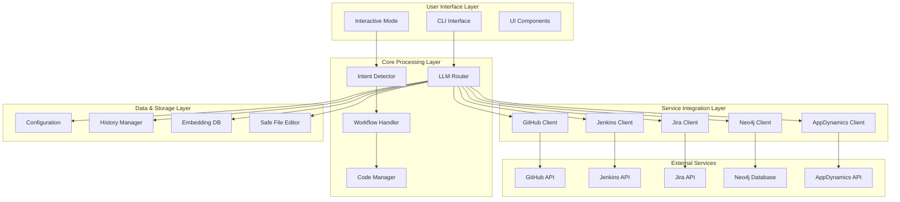
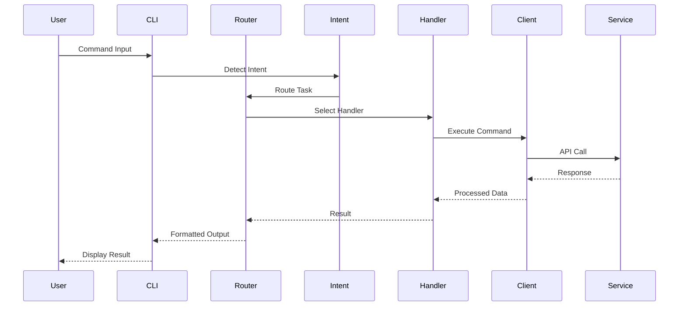

# 🏗️ Lumos CLI Technical Architecture

## 📋 Table of Contents
- [Overview](#overview)
- [System Architecture](#system-architecture)
- [Directory Structure](#directory-structure)
- [Core Modules](#core-modules)
- [Client Integrations](#client-integrations)
- [Interactive System](#interactive-system)
- [Configuration Management](#configuration-management)
- [Data Flow](#data-flow)
- [Testing Architecture](#testing-architecture)
- [Deployment](#deployment)

## 🌟 Overview

Lumos CLI is a modular, AI-powered command-line interface designed for enterprise environments. It provides intelligent code assistance, integrates with multiple external services, and offers both command-line and interactive modes.

### Key Design Principles
- **Modularity**: Clean separation of concerns with dedicated modules
- **Extensibility**: Easy to add new integrations and features
- **Safety**: Built-in validation, backup, and rollback mechanisms
- **Performance**: Asynchronous operations and efficient resource management
- **Enterprise-Ready**: Secure credential management and audit logging

## 🏛️ System Architecture



## 📁 Directory Structure

```
src/lumos_cli/
├── core/                           # Core functionality modules
│   ├── __init__.py                # Core module exports
│   ├── router.py                  # LLM routing and task classification
│   ├── embeddings.py              # Vector embeddings and similarity search
│   ├── safety.py                  # File safety and validation
│   ├── history.py                 # Command and session history
│   ├── persona_manager.py         # User persona management
│   ├── code_manager.py            # Code generation and management
│   ├── workflow_handler.py        # Multi-step workflow orchestration
│   ├── intent_detector.py         # Intent detection and classification
│   └── keyword_detector.py        # Unified LLM-based keyword detection
├── clients/                        # External service clients
│   ├── __init__.py                # Client module exports
│   ├── github_client.py           # GitHub API integration
│   ├── jenkins_client.py          # Jenkins API integration
│   ├── jira_client.py             # Jira API integration
│   ├── neo4j_client.py            # Neo4j graph database client
│   ├── neo4j_dotnet_client.py     # .NET-specific Neo4j client
│   └── appdynamics_client.py      # AppDynamics monitoring client
├── config/                         # Configuration management
│   ├── __init__.py                # Config module exports
│   ├── github_config_manager.py   # GitHub configuration
│   ├── jenkins_config_manager.py  # Jenkins configuration
│   ├── jira_config_manager.py     # Jira configuration
│   ├── neo4j_config.py            # Neo4j configuration
│   ├── appdynamics_config.py      # AppDynamics configuration
│   ├── enterprise_llm_config.py   # Enterprise LLM configuration
│   ├── managers.py                # Configuration managers
│   └── validators.py              # Configuration validation
├── commands/                       # Command modules
│   ├── __init__.py                # Command exports
│   ├── github.py                  # GitHub commands
│   └── jenkins.py                 # Jenkins commands
├── interactive/                    # Interactive mode system
│   ├── __init__.py                # Interactive exports
│   ├── mode.py                    # Main interactive mode
│   ├── intent_detection.py        # Interactive intent detection
│   └── handlers/                   # Command handlers
│       ├── __init__.py            # Handler exports
│       ├── github_handler.py      # GitHub interactive handlers
│       ├── jenkins_handler.py     # Jenkins interactive handlers
│       ├── jira_handler.py        # Jira interactive handlers
│       ├── neo4j_handler.py       # Neo4j interactive handlers
│       ├── appdynamics_handler.py # AppDynamics interactive handlers
│       └── code_handler.py        # Code management handlers
├── ui/                            # User interface components
│   ├── __init__.py                # UI exports
│   ├── console.py                 # Console utilities
│   ├── footer.py                  # CLI footer display
│   └── panels.py                  # Rich UI panels
├── utils/                         # Shared utilities
│   ├── __init__.py                # Utility exports
│   ├── debug_logger.py            # Debug logging system
│   ├── error_handler.py           # Error handling utilities
│   ├── failure_analyzer.py        # Failure analysis and diagnosis
│   ├── file_discovery.py          # Smart file discovery
│   ├── github_query_parser.py     # GitHub query parsing
│   ├── platform_utils.py          # Platform-specific utilities
│   ├── scaffold.py                # Project scaffolding
│   └── shell_executor.py          # Shell command execution
├── cli_refactored_v2.py           # Main CLI entry point
├── config.py                      # Main configuration
├── agentic_router.py              # Agentic routing system
├── app_detector.py                # Application detection
├── enterprise_llm.py              # Enterprise LLM integration
├── enterprise_llm_replica.py      # Enterprise LLM replica
├── environment_manager.py         # Environment management
├── gpt4_simulator.py              # GPT-4 simulation
├── huggingface_manager.py         # Hugging Face integration
├── logger.py                      # Logging system
├── prompts.py                     # Prompt templates
├── safe_code_executor.py          # Safe code execution
└── __init__.py                    # Package initialization
```

## 🔧 Core Modules

### 1. Router (`core/router.py`)
**Purpose**: Central LLM routing and task classification system

**Key Functions**:
- `LLMRouter`: Main routing class for LLM selection
- `TaskType`: Enum for task classification
- `route_task()`: Routes tasks to appropriate LLM backend
- `get_available_backends()`: Lists available LLM backends

**Dependencies**: OpenAI, Ollama, Hugging Face, Enterprise LLM

### 2. Embeddings (`core/embeddings.py`)
**Purpose**: Vector embeddings and similarity search

**Key Functions**:
- `EmbeddingDB`: Database for storing and querying embeddings
- `add_document()`: Adds documents to embedding database
- `search_similar()`: Performs similarity search
- `get_embedding()`: Generates embeddings for text

**Dependencies**: OpenAI embeddings, FAISS (optional)

### 3. Safety (`core/safety.py`)
**Purpose**: File safety, validation, and backup management

**Key Functions**:
- `SafeFileEditor`: Safe file editing with validation
- `validate_file()`: Validates file before editing
- `create_backup()`: Creates file backups
- `rollback_changes()`: Rolls back changes if needed

**Features**: File validation, automatic backups, rollback capability

### 4. History (`core/history.py`)
**Purpose**: Command and session history management

**Key Functions**:
- `HistoryManager`: Manages command history
- `add_command()`: Adds commands to history
- `get_recent_commands()`: Retrieves recent commands
- `search_history()`: Searches command history

**Storage**: JSON files with encryption support

### 5. Intent Detector (`core/intent_detector.py`)
**Purpose**: Intelligent intent detection and classification

**Key Functions**:
- `IntentDetector`: Main intent detection class
- `detect_intent()`: Detects user intent from input
- `classify_task()`: Classifies task type
- `extract_entities()`: Extracts entities from input

**Algorithms**: Hybrid LLM + regex approach

### 6. Code Manager (`core/code_manager.py`)
**Purpose**: Code generation, editing, and management

**Key Functions**:
- `CodeManager`: Main code management class
- `generate_code()`: Generates code based on requirements
- `edit_code()`: Edits existing code
- `validate_code()`: Validates generated code
- `format_code()`: Formats code according to standards

**Features**: Multi-language support, syntax validation, formatting

### 7. Keyword Detector (`core/keyword_detector.py`)
**Purpose**: Unified LLM-based keyword detection for all integrations

**Key Functions**:
- `UnifiedKeywordDetector`: Central keyword detection system
- `IntegrationKeywordDetector`: Base class for integration-specific detectors
- `GitHubKeywordDetector`: GitHub-specific keyword detection
- `JenkinsKeywordDetector`: Jenkins-specific keyword detection
- `JiraKeywordDetector`: Jira-specific keyword detection
- `Neo4jKeywordDetector`: Neo4j-specific keyword detection
- `AppDynamicsKeywordDetector`: AppDynamics-specific keyword detection

**Features**: LLM-based natural language processing, integration-specific prompts, confidence scoring

### 8. Workflow Handler (`core/workflow_handler.py`)
**Purpose**: Multi-step workflow orchestration

**Key Functions**:
- `WorkflowHandler`: Orchestrates complex workflows
- `execute_workflow()`: Executes multi-step workflows
- `validate_workflow()`: Validates workflow steps
- `rollback_workflow()`: Rolls back failed workflows

**Features**: Step validation, error recovery, progress tracking

## 🔗 Client Integrations

### 1. GitHub Client (`clients/github_client.py`)
**Purpose**: GitHub API integration and repository management

**Key Functions**:
- `GitHubClient`: Main GitHub client class
- `get_repository()`: Fetches repository information
- `get_pull_requests()`: Retrieves PR information
- `get_commits()`: Fetches commit details
- `clone_repository()`: Clones repositories
- `create_pull_request()`: Creates PRs

**Authentication**: Personal Access Tokens, OAuth2
**API Version**: REST API v4

### 2. Jenkins Client (`clients/jenkins_client.py`)
**Purpose**: Jenkins CI/CD integration and build management

**Key Functions**:
- `JenkinsClient`: Main Jenkins client class
- `get_jobs()`: Lists Jenkins jobs
- `get_builds()`: Retrieves build information
- `trigger_build()`: Triggers builds
- `get_build_logs()`: Fetches build logs
- `analyze_failure()`: Analyzes build failures

**Authentication**: API tokens, Basic Auth
**Features**: Build monitoring, failure analysis, log streaming

### 3. Jira Client (`clients/jira_client.py`)
**Purpose**: Jira issue tracking and project management

**Key Functions**:
- `JiraClient`: Main Jira client class
- `get_issues()`: Fetches Jira issues
- `create_issue()`: Creates new issues
- `update_issue()`: Updates existing issues
- `get_comments()`: Retrieves issue comments
- `search_issues()`: Searches issues with JQL

**Authentication**: Personal Access Tokens (Bearer), Basic Auth
**API Version**: REST API latest

### 4. Neo4j Client (`clients/neo4j_client.py`)
**Purpose**: Neo4j graph database integration with LLM-generated queries

**Key Functions**:
- `Neo4jClient`: Main Neo4j client class
- `execute_query()`: Executes Cypher queries
- `get_schema_info()`: Retrieves comprehensive database schema
- `generate_cypher_query()`: LLM-based query generation
- `execute_llm_generated_query()`: End-to-end LLM query execution
- `list_all_repositories()`: Lists all repositories in graph
- `get_repository_stats()`: Gets repository statistics
- `analyze_dependencies()`: Analyzes code dependencies
- `find_impact_analysis()`: Performs impact analysis

**Authentication**: Username/password, LDAP
**Features**: Graph analysis, dependency mapping, schema introspection, LLM query generation

### 5. AppDynamics Client (`clients/appdynamics_client.py`)
**Purpose**: AppDynamics application performance monitoring

**Key Functions**:
- `AppDynamicsClient`: Main AppDynamics client class
- `get_applications()`: Lists applications
- `get_metrics()`: Retrieves performance metrics
- `get_alerts()`: Fetches alerts
- `get_transactions()`: Gets transaction data
- `get_errors()`: Retrieves error information

**Authentication**: OAuth2 client credentials
**API Version**: Events API v2

## 💬 Interactive System

### 1. Interactive Mode (`interactive/mode.py`)
**Purpose**: Main interactive mode controller

**Key Functions**:
- `interactive_mode()`: Main interactive loop
- `process_command()`: Processes user commands
- `show_prompt()`: Displays interactive prompt
- `handle_exit()`: Handles exit commands

**Features**: Command history, auto-completion, context awareness

### 2. Intent Detection (`interactive/intent_detection.py`)
**Purpose**: Interactive intent detection and routing

**Key Functions**:
- `detect_intent()`: Detects user intent
- `classify_command()`: Classifies command type
- `extract_parameters()`: Extracts command parameters
- `suggest_commands()`: Suggests available commands

**Algorithms**: LLM-based with regex fallback

### 3. Command Handlers (`interactive/handlers/`)
**Purpose**: Specialized handlers for different services

**Handlers**:
- `github_handler.py`: GitHub-specific commands
- `jenkins_handler.py`: Jenkins-specific commands
- `jira_handler.py`: Jira-specific commands
- `neo4j_handler.py`: Neo4j-specific commands
- `appdynamics_handler.py`: AppDynamics-specific commands
- `code_handler.py`: Code management commands

## ⚙️ Configuration Management

### 1. Configuration Managers (`config/`)
**Purpose**: Centralized configuration management

**Managers**:
- `github_config_manager.py`: GitHub configuration
- `jenkins_config_manager.py`: Jenkins configuration
- `jira_config_manager.py`: Jira configuration
- `neo4j_config.py`: Neo4j configuration
- `appdynamics_config.py`: AppDynamics configuration
- `enterprise_llm_config.py`: Enterprise LLM configuration

**Features**:
- Secure credential storage
- Environment variable support
- Configuration validation
- Encrypted storage (optional)

### 2. Configuration Structure
```json
{
  "github": {
    "base_url": "https://api.github.com",
    "token": "encrypted_token",
    "organization": "company"
  },
  "jenkins": {
    "base_url": "https://jenkins.company.com",
    "username": "user",
    "token": "encrypted_token"
  },
  "jira": {
    "base_url": "https://company.atlassian.net",
    "email": "user@company.com",
    "token": "encrypted_token"
  },
  "neo4j": {
    "uri": "bolt://localhost:7687",
    "username": "neo4j",
    "password": "encrypted_password"
  },
  "appdynamics": {
    "controller_url": "https://company.saas.appdynamics.com",
    "client_id": "encrypted_id",
    "client_secret": "encrypted_secret"
  }
}
```

## 🔄 Data Flow



## 🧪 Testing Architecture

### 1. Test Structure
```
tests/
├── unit/                    # Unit tests
│   ├── core/               # Core module tests
│   ├── clients/            # Client tests
│   └── interactive/        # Interactive mode tests
├── integration/            # Integration tests
├── functional/             # Functional tests
├── test_runner.py          # Comprehensive test runner
├── quick_test.py           # Quick functionality test
└── test_config.py          # Test configuration
```

### 2. Test Categories
- **Unit Tests**: Individual module testing
- **Integration Tests**: Service integration testing
- **Functional Tests**: End-to-end functionality testing
- **Performance Tests**: Load and performance testing

### 3. Test Commands
```bash
make test-quick             # Quick functionality test
make test-all               # Comprehensive test suite
make test-feature FEATURE=github  # Feature-specific tests
python test_lumos.py --quick     # Direct test execution
```

## 🚀 Deployment

### 1. Installation
```bash
# Development installation
pip install -e .

# Production installation
pip install lumos-cli
```

### 2. Configuration
```bash
# Interactive configuration
lumos-cli config setup

# Manual configuration
lumos-cli github config
lumos-cli jenkins config
lumos-cli jira config
```

### 3. Environment Variables
```bash
export LUMOS_GITHUB_TOKEN="your_token"
export LUMOS_JENKINS_URL="https://jenkins.company.com"
export LUMOS_JIRA_URL="https://company.atlassian.net"
```

## 📊 Performance Characteristics

### 1. Response Times
- **Quick Commands**: < 1 second
- **LLM Operations**: 2-10 seconds
- **API Calls**: 1-5 seconds
- **Complex Workflows**: 10-60 seconds

### 2. Resource Usage
- **Memory**: 50-200 MB typical
- **CPU**: Low during idle, moderate during processing
- **Network**: Minimal for local operations, moderate for API calls

### 3. Scalability
- **Concurrent Users**: Single-user application
- **API Rate Limits**: Respects service rate limits
- **Caching**: Implements intelligent caching for performance

## 🔒 Security Features

### 1. Credential Management
- Encrypted credential storage
- Environment variable support
- Secure token rotation
- Audit logging

### 2. File Safety
- File validation before editing
- Automatic backups
- Rollback capability
- Permission checking

### 3. API Security
- Token-based authentication
- HTTPS enforcement
- Request validation
- Error sanitization

## 🛠️ Development Guidelines

### 1. Code Standards
- PEP 8 compliance
- Type hints for all functions
- Comprehensive docstrings
- Unit test coverage > 80%

### 2. Module Design
- Single responsibility principle
- Loose coupling, high cohesion
- Clear interfaces
- Error handling

### 3. Testing Requirements
- Unit tests for all modules
- Integration tests for clients
- Functional tests for workflows
- Performance tests for critical paths

---

**Last Updated**: September 2024  
**Version**: 2.0.0  
**Maintainer**: Lumos CLI Team
